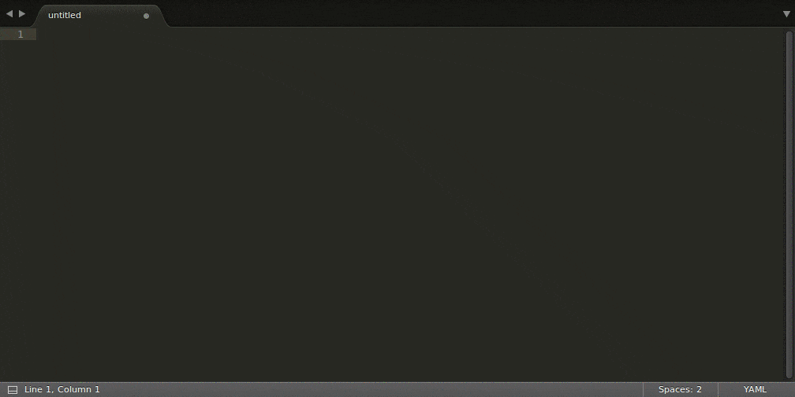

<!--#
title: 'Web Automation Markup Language 2.0'
description: 'Human-readable way to define action sequences to perform on a web resources.'
#-->

# WAML 2.0

[](https://travis-ci.org/automate-website/waml) [](https://gitter.im/automate-website/waml?utm_source=badge&utm_medium=badge&utm_campaign=pr-badge) 

[](img/scenario-register-at-automate-website-write-and-run.gif)


**Notice**: WAML is currently in a very early draft version. Feel free to create a pull request in case of useful suggestions.

Refer to the [changelog] for recent notable changes and modifications.


## Abstract
```yaml
# Example of login process automation
name: Sign in
steps:
  - open: 'https://example.com/login'
  - enter:
      selector: input[name=email]
      input: username@example.com
  - enter:
      selector: input[name=password]
      input: s3cr3t
  - click: button[type=submit]
```

Web Automation Markup Language (WAML) is definition of action sequences which can be performed on web resources (e.g. regular web pages) within a context of a web browser to simulate user behavior. The WAML specification defines an application of [YAML 1.2] which allows an expirienced user to create a human and machine readable sequence at one go, reuse sequences in any order, and perform context dependent actions.


## Terminology

The underlying format for WAML is YAML so that it inherits all its benefits such as hosting of multiple document within one stream. A WAML stream may contain multiple _scenarios_. Every _scenario_ must be represented by a set of _metadata_ as well as sequence of _actions_ to execute. Every _action_ must have at least one _criteria_ which is represented as _scalar_ (string, integer, etc.) value or a _mapping_.

The key words "MUST", "MUST NOT", "REQUIRED", "SHALL", "SHALL NOT", "SHOULD", "SHOULD NOT", "RECOMMENDED", "MAY", and "OPTIONAL" in this document are to be interpreted as described in [RFC 2119].


## Schema

WAML is based on [JSON Schema] that lives at [waml-schema.org]. WAML schema is available in [YAML][waml-yaml] and [JSON][waml-json] formats. A scenario within a WAML stream may define the preferred schema version by defining ```$schema``` property, otherwise a default parser schema is used.


## Scenario Schema

```yaml
name: Name of the scenario
steps:
  - open: www.example.com
```

A very basic scenario must contain a `name` and `steps` property. The list of actions may be empty, however, it is reasonable to have at least one action.

### Minimal Example

```yaml
name: full-featured-scenario
description: A full featured scenario
fragment: false
precendence: 100
timeout: 5
if: ${ true }
steps:
  - open: www.example.com
```

This minimal example demonstrates the simplicity of WAML. The full list of supported metadata is depicted below.

| Property | Description | Type |
|---|---|---|
| name |Unique name that is used to reference a certain scenario. |string |
| description |_(Optional)_ Short summary of the overall scenario purpose. |string |
| fragment |_(Optional)_ Defines if a scenario is a fragment or may be executed stand-alone. __Default:__ false |boolean |
| precendence |_(Optional)_ Defines the particular priority of the scenario during execution of independent scenarios. __Default:__ -1 |integer |
| steps |Sequence of actions. |_Sequence of:_<br/>[step-schema](#step-schema) |
| if |_(Optional)_ If set, the step is only executed if the value evaluates to true. |_One of:_<br/>[expression-schema](#expression-schema),<br/> boolean |
| unless |_(Optional)_ If set, the step is only executed if the value evaluates to false. |_One of:_<br/>[expression-schema](#expression-schema),<br/> boolean |
| timeout |_(Optional)_ Maximal time [s] to wait for the element which meets the given criteria. __Default:__ 5 |_One of:_<br/>[expression-schema](#expression-schema),<br/> number |


Using this properties, the following more comprehensive example can be created:


## Step Schema

The steps property must be represented as a sequence of actions. Every step represents the smallest identifiable user action.

| Property | Description | Type |
|---|---|---|
|  &ndash;  |A step represents the smallest identifiable user action. |_One of:_<br/>[open-step-schema](#open-step-schema),<br/> [include-step-schema](#include-step-schema),<br/> [store-step-schema](#store-step-schema),<br/> [ensure-step-schema](#ensure-step-schema),<br/> [click-step-schema](#click-step-schema),<br/> [select-step-schema](#select-step-schema),<br/> [enter-step-schema](#enter-step-schema),<br/> [move-step-schema](#move-step-schema),<br/> [wait-step-schema](#wait-step-schema) |


## Fragment Scenarios

```yaml
name: fragment-scenario
fragment: true
steps:
  - open: www.example.com
```

Fragment scenarios can not be executed independently but can only be used in ```include``` actions of other scenarios or fragments.


## Actions and Criteria
### Open

```yaml
# Short notation
name: Open demonstration scenario
steps:
  - open: www.example.com
```
```yaml
# Full notation
name: 'Open demonstration scenario 2'
steps:
  - unless: ${isMobile}
    open:
      url: www.example.com
  - if: ${isMobile}
    open:
      url: m.example.com
```

Like for a real user, `open` is often the very first action of a scenarios. It triggers the navigation to a particular URL inside the web browser.
The `http://` scheme should be automatically added to the `url` if no scheme is specified.

#### Open Step Schema

| Property | Description | Type |
|---|---|---|
| open |The URL to which the navigation takes place as value or a complex open criteria. |_One of:_<br/>[expression-schema](#expression-schema),<br/> [open-criteria-schema](#open-criteria-schema) |
| if |_(Optional)_ If set, the step is only executed if the value evaluates to true. |_One of:_<br/>[expression-schema](#expression-schema),<br/> boolean |
| unless |_(Optional)_ If set, the step is only executed if the value evaluates to false. |_One of:_<br/>[expression-schema](#expression-schema),<br/> boolean |
| timeout |_(Optional)_ Maximal time [s] to wait for the element which meets the given criteria. __Default:__ 5 |_One of:_<br/>[expression-schema](#expression-schema),<br/> number |


#### Open Criteria Schema

| Property | Description | Type |
|---|---|---|
| url |The URL to which the navigation takes place. |[expression-schema](#expression-schema) |


### Ensure

```yaml
# Short notation of 'ensure'
name: Ensure demonstation scenario
steps:
  - open: www.example.com
  - ensure: h1.greeting
```
```yaml
# Full notation
name: Ensure scenario with additional contstraints
steps:
  - open: www.example.com
  - timeout: 4
    ensure:
      selector: h1.greeting
      value: 'Welcome to example.com!'
```

To verify the integrity of the page it may be reasonable to ensure the presence of a certain element. The action ```ensure``` verifies, whether the particular element is present on the page.

The depicted simple scenario can be created using the shot-notation of ```ensure``` action:

1. Open a web page.
2. Verify the presence of a header with a certain class.

Using the additional criteria not only the presence of the element can be ensured but also elements content and its appearance within a defined a time constraint.

#### Ensure Step Schema

| Property | Description | Type |
|---|---|---|
| ensure |A CSS selector as value or a hash of conditionals. |_One of:_<br/>[expression-schema](#expression-schema),<br/> [ensure-criteria-schema](#ensure-criteria-schema) |
| if |_(Optional)_ If set, the step is only executed if the value evaluates to true. |_One of:_<br/>[expression-schema](#expression-schema),<br/> boolean |
| unless |_(Optional)_ If set, the step is only executed if the value evaluates to false. |_One of:_<br/>[expression-schema](#expression-schema),<br/> boolean |
| timeout |_(Optional)_ Maximal time [s] to wait for the element which meets the given criteria. __Default:__ 5 |_One of:_<br/>[expression-schema](#expression-schema),<br/> number |


#### Ensure Criteria Schema

| Property | Description | Type |
|---|---|---|
| selector |CSS selector of element to select. |[expression-schema](#expression-schema) |
| text |_(Optional)_ Select element which text represenation contains the given value. |[expression-schema](#expression-schema) |
| value |_(Optional)_ Verify value attribute against this value. |_One of:_<br/>number,<br/> boolean,<br/> [expression-schema](#expression-schema) |
| absent |_(Optional)_ If set to true, the element matching remaining criteria is expected to be absent. __Default:__ false |boolean |
| parent |_(Optional)_ Presence of the parent element according given creteria. |_One of:_<br/>[expression-schema](#expression-schema),<br/> [parent-criteria-schema](#parent-criteria-schema) |


### Move

```yaml
# Short notation
name: Move demonstation scenario
steps:
  - open: www.example.com
  - move: a.help
  - ensure:
      selector: .help-tooltip
      text: 'Click here to get help.'
```

```yaml
# Full notation
name: Move demonstation scenario
steps:
  - open: www.example.com
  - move:
      selector: a.help
      text: 'Need help?'
      parent:
        selector: .help-container
  - ensure: .help-tooltip
```

For hidden elements which appear only after the user has hovered a certain element the (mouse) ```move``` action can be used.  

The examples depicts the usage of the ```move``` action. 

#### Move Step Schema

| Property | Description | Type |
|---|---|---|
| move |A CSS selector as value or a complex move criteria. |_One of:_<br/>[expression-schema](#expression-schema),<br/> [move-criteria-schema](#move-criteria-schema) |
| if |_(Optional)_ If set, the step is only executed if the value evaluates to true. |_One of:_<br/>[expression-schema](#expression-schema),<br/> boolean |
| unless |_(Optional)_ If set, the step is only executed if the value evaluates to false. |_One of:_<br/>[expression-schema](#expression-schema),<br/> boolean |
| timeout |_(Optional)_ Maximal time [s] to wait for the element which meets the given criteria. __Default:__ 5 |_One of:_<br/>[expression-schema](#expression-schema),<br/> number |


#### Move Criteria Schema

| Property | Description | Type |
|---|---|---|
| selector |CSS selector of element to select. |[expression-schema](#expression-schema) |
| text |_(Optional)_ Select element which text represenation contains the given value. |[expression-schema](#expression-schema) |
| parent |_(Optional)_ Presence of the parent element according given creteria. |_One of:_<br/>[expression-schema](#expression-schema),<br/> [parent-criteria-schema](#parent-criteria-schema) |


### Click

```yaml
name: Click demonstration scenario
steps:
  - open: www.example.com
  - click: a.sign-up
```
```yaml
name: Click demonstration scenario 2
steps:
  - open: www.example.com
  - if: ${isDesktop}
    click:
      selector: a.sign-up
      text: 'Join now for free!'

  - if: ${isMobile}
    click:
      selector: a.sign-up
      text: 'Join now!'
```

Every kind of clicks can be simulated with the ```click``` action.

In the short notation example a click happens on an anchor element selected by CSS. 
Also the ```text``` criteria may be used to verify the wording of the target.

#### Click Step Schema

| Property | Description | Type |
|---|---|---|
| click |A CSS selector as value or a mapping of criteria. |_One of:_<br/>[expression-schema](#expression-schema),<br/> [click-criteria-schema](#click-criteria-schema) |
| if |_(Optional)_ If set, the step is only executed if the value evaluates to true. |_One of:_<br/>[expression-schema](#expression-schema),<br/> boolean |
| unless |_(Optional)_ If set, the step is only executed if the value evaluates to false. |_One of:_<br/>[expression-schema](#expression-schema),<br/> boolean |
| timeout |_(Optional)_ Maximal time [s] to wait for the element which meets the given criteria. __Default:__ 5 |_One of:_<br/>[expression-schema](#expression-schema),<br/> number |


#### Click Criteria Schema

| Property | Description | Type |
|---|---|---|
| selector |CSS selector of element to select. |[expression-schema](#expression-schema) |
| text |_(Optional)_ Select element which text represenation contains the given value. |[expression-schema](#expression-schema) |
| parent |_(Optional)_ Presence of the parent element according given creteria. |_One of:_<br/>[expression-schema](#expression-schema),<br/> [parent-criteria-schema](#parent-criteria-schema) |


### Select

```yaml
# Short notation
name: Select demonstration scenario
steps:
  - open: www.example.com
  - select: '.actions option:first-child'
```
```yaml
# Full notation of 'select'
name: 'Select demonstration scenario 2'
steps:
  - open: www.example.com
  - select:
      selector: .title
      text: 'PROF DR'
  - select:
      selector: .country
      value: 'CH'
```

Short notation example of ```select``` and a complex example.

#### Select Step Schema

| Property | Description | Type |
|---|---|---|
| select |CSS selector of element to select or an object of select criteria. |_One of:_<br/>[expression-schema](#expression-schema),<br/> [select-criteria-schema](#select-criteria-schema) |
| if |_(Optional)_ If set, the step is only executed if the value evaluates to true. |_One of:_<br/>[expression-schema](#expression-schema),<br/> boolean |
| unless |_(Optional)_ If set, the step is only executed if the value evaluates to false. |_One of:_<br/>[expression-schema](#expression-schema),<br/> boolean |
| timeout |_(Optional)_ Maximal time [s] to wait for the element which meets the given criteria. __Default:__ 5 |_One of:_<br/>[expression-schema](#expression-schema),<br/> number |


#### Select Criteria Schema

| Property | Description | Type |
|---|---|---|
| selector |CSS selector of element to select. |[expression-schema](#expression-schema) |
| text |_(Optional)_ Select element which text represenation contains the given value. |[expression-schema](#expression-schema) |
| parent |_(Optional)_ Presence of the parent element according given creteria. |_One of:_<br/>[expression-schema](#expression-schema),<br/> [parent-criteria-schema](#parent-criteria-schema) |
| value |_(Optional)_ Value attribute will be checked against this value. |_One of:_<br/>[expression-schema](#expression-schema),<br/> number,<br/> boolean |


### Enter

```yaml
# Full notation of 'enter'
name: Enter demonstration scenario
steps:
  - open: www.example.com
  - enter:
      selector: input.email
      input: 'me@example.com'
  - enter:
      selector: input.password
      input: 'secret'
  - enter:
      selector: input.easy-captcha
      value: 1234
      input: 3421
  - click: button[type=submit]
```

#### Enter Step Schema

| Property | Description | Type |
|---|---|---|
| enter |Send a sequence of key strokes to an element. |_One of:_<br/>[enter-criteria-schema](#enter-criteria-schema) |
| if |_(Optional)_ If set, the step is only executed if the value evaluates to true. |_One of:_<br/>[expression-schema](#expression-schema),<br/> boolean |
| unless |_(Optional)_ If set, the step is only executed if the value evaluates to false. |_One of:_<br/>[expression-schema](#expression-schema),<br/> boolean |
| timeout |_(Optional)_ Maximal time [s] to wait for the element which meets the given criteria. __Default:__ 5 |_One of:_<br/>[expression-schema](#expression-schema),<br/> number |


#### Enter Criteria Schema

| Property | Description | Type |
|---|---|---|
| selector |CSS selector of element to select. |[expression-schema](#expression-schema) |
| text |_(Optional)_ Select element which text represenation contains the given value. |[expression-schema](#expression-schema) |
| parent |_(Optional)_ Presence of the parent element according given creteria. |_One of:_<br/>[expression-schema](#expression-schema),<br/> [parent-criteria-schema](#parent-criteria-schema) |
| value |_(Optional)_ Value of element to select. |_One of:_<br/>[expression-schema](#expression-schema),<br/> number,<br/> boolean |
| input |Value to set. |_One of:_<br/>[expression-schema](#expression-schema),<br/> number,<br/> boolean |


### Wait

```yaml
# Short notation of 'wait'
name: Wait 2.5 seconds demonstration scenario
steps:
  - open: www.example.com
  - wait: 2.5
```
```yaml
# Full notation of 'wait'
name: 'Wait 5 seconds demonstration scenario 2'
steps:
  - open: www.example.com
  - if: ${slowConnection}
    wait:
      time: 5
```

Short notation examples of ```wait```.

#### Wait Step Schema

| Property | Description | Type |
|---|---|---|
| wait |Time to wait in [s] or an object of wait criteria. |_One of:_<br/>[wait-criteria-schema](#wait-criteria-schema),<br/> [expression-schema](#expression-schema),<br/> number |
| if |_(Optional)_ If set, the step is only executed if the value evaluates to true. |_One of:_<br/>[expression-schema](#expression-schema),<br/> boolean |
| unless |_(Optional)_ If set, the step is only executed if the value evaluates to false. |_One of:_<br/>[expression-schema](#expression-schema),<br/> boolean |


#### Wait Criteria Schema

| Property | Description | Type |
|---|---|---|
| time |Time to wait in [s]. |_One of:_<br/>[expression-schema](#expression-schema),<br/> number |


### Include

```yaml
name: Include demonstation scenario
steps:
  - include: 'Click demonstration scenario'
```
```yaml
name: Include demonstation scenario
steps:
  - if: ${isDesktop}
    include:
      scenario: 'Click demonstration scenario'
```

Short notation example of ```include``` and a complex example.

#### Include Step Schema

| Property | Description | Type |
|---|---|---|
| include |Scenario name to include or include criteria. |_One of:_<br/>[include-criteria-schema](#include-criteria-schema),<br/> [expression-schema](#expression-schema) |
| if |_(Optional)_ If set, the step is only executed if the value evaluates to true. |_One of:_<br/>[expression-schema](#expression-schema),<br/> boolean |
| unless |_(Optional)_ If set, the step is only executed if the value evaluates to false. |_One of:_<br/>[expression-schema](#expression-schema),<br/> boolean |
| timeout |_(Optional)_ Maximal time [s] to wait for the element which meets the given criteria. __Default:__ 5 |_One of:_<br/>[expression-schema](#expression-schema),<br/> number |


#### Include Criteria Schema

| Property | Description | Type |
|---|---|---|
| scenario |The name of the scenario to include. |[expression-schema](#expression-schema) |


### Store

```yaml
name: Store demonstration scenario
steps:
  - store:
      language: 'en'
```
```yaml
name: Store demonstration scenario 2
steps:
  - if: ${isOldComputer}
    store:
      display_resolution: '1024x768'
      isDesktop: true
      1080p: false
      width: 1024
```

An example of simple usage of ```store``` as well as a more complex example.

#### Store Step Schema

| Property | Description | Type |
|---|---|---|
| store |A mapping of variables to be defined in the execution context. |object |
| if |_(Optional)_ If set, the step is only executed if the value evaluates to true. |_One of:_<br/>[expression-schema](#expression-schema),<br/> boolean |
| unless |_(Optional)_ If set, the step is only executed if the value evaluates to false. |_One of:_<br/>[expression-schema](#expression-schema),<br/> boolean |


#### Store Criteria Schema

| Property | Description | Type |
|---|---|---|
| ^([a-zA-Z0-9_.])+$ |_(Optional)_ Random key matching the given pattern with a value. |_One of:_<br/>[expression-schema](#expression-schema),<br/> boolean,<br/> number |


## Expressions
### Expression Schema

| Property | Description | Type |
|---|---|---|
|  &ndash;  |An expression is a evaluable statement that can be utilized on certain properties. |string |


## Shared Criteria
### Parent Criteria Schema

| Property | Description | Type |
|---|---|---|
| selector |CSS selector of element to select. |[expression-schema](#expression-schema) |
| text |_(Optional)_ Select element which text represenation contains the given value. |[expression-schema](#expression-schema) |


## Management of Multiple Scenarios

A single WAML file may contain multiple scenarios. Therefore, the capability of YAML to store multiple documents by splitting them with ```---``` is used.


[YAML 1.2]: http://yaml.org/spec/1.2/spec.html
[RFC 2119]: https://www.ietf.org/rfc/rfc2119.txt

[JSON Schema]: http://json-schema.org/
[changelog]: CHANGELOG.md
[waml-json]: dist/waml.json
[waml-yaml]: dist/waml.yaml
[waml-schema.org]: http://waml-schema.org
